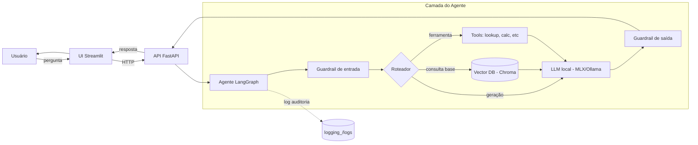

# medical-assistant

Assistente médico construído como Tech Challenge da pós-graduação (Fase 3).
Combina um **LLM fine-tuned com dados médicos**, **LangChain** para
orquestração, **LangGraph** para fluxos de decisão e **guardrails** para
segurança e auditoria.

> ⚠️ Projeto acadêmico. **Não substitui orientação médica profissional.**

---

## Sobre o Projeto

O objetivo é demonstrar, ponta-a-ponta, como construir um assistente de
domínio especializado a partir de um modelo de linguagem de propósito geral:

1. **Fine-tuning local** de um modelo base (Qwen2.5-1.5B-Instruct) com
   dados médicos sintéticos, usando LoRA via mlx-lm no Mac M1.
2. **Inferência local** no Mac Apple Silicon via MLX (ou Ollama como
   fallback), sem depender de APIs pagas.
3. **Orquestração** com LangChain (cadeias, prompts, parsers) e
   **LangGraph** (grafos de decisão com estado, p.ex. "consultar base
   antes de responder").
4. **RAG** (Retrieval-Augmented Generation — recuperar contexto antes de
   gerar) sobre uma base vetorial Chroma com embeddings de
   `sentence-transformers`.
5. **Guardrails**: filtros de entrada/saída, prompts defensivos,
   verificação de claims e **log de auditoria** de toda interação.
6. **Interface**: API FastAPI + frontend Streamlit para a demonstração.

---

## Arquitetura



**Leitura rápida:** o usuário interage com a UI; cada pergunta passa por
um guardrail de entrada, é roteada pelo LangGraph para consultar a base
vetorial e/ou ferramentas, gera uma resposta no LLM local, passa por um
guardrail de saída e é registrada em log de auditoria.

---

## Como Rodar

### Pré-requisitos (uma vez)

```bash
uv sync --extra data --extra dev --extra inference --extra ui
cp .env.example .env       # edite e cole a OPENAI_API_KEY (só usada na Fase 1)
```

### Geração do dataset sintético (Fase 1)

```bash
uv run python -m spacy download pt_core_news_lg
uv run pytest data/test_anonymization.py -v
uv run python data/generate_synthetic.py
uv run python data/prepare_dataset.py
```

### Fine-tuning local (Fase 2, ~30-60 min)

Detalhes em [finetuning/README.md](finetuning/README.md).

```bash
uv run python finetuning/prepare_mlx_dataset.py
uv run python finetuning/train.py --smoke-test   # 2-3 min, valida o setup
uv run python finetuning/train.py                # treino real
uv run python finetuning/evaluate.py
```

### Como conversar com o assistente (Fase 3)

Após o fine-tuning, o assistente é um wrapper LangChain do modelo
treinado. Detalhes em [assistant/README.md](assistant/README.md).

```bash
uv run python assistant/demo_chat.py             # com system prompt clínico
uv run python assistant/demo_chat.py --show-system  # exibe o system prompt
uv run python assistant/demo_chat.py --base         # sem system prompt (pra comparar)
```

Comparativo automático (sem vs com system prompt):

```bash
uv run python evaluation/eval_system_prompt.py
cat evaluation/comparison_phase3.md
```

### Próximas fases (em desenvolvimento)

- **Fase 4** — RAG com Chroma + sentence-transformers.
- **Fase 5** — Agente LangGraph com decisão de rota.
- **Fase 6** — Guardrails de entrada/saída + log de auditoria.
- **Fase 7** — API FastAPI + UI Streamlit.

---

## Estrutura de Pastas

```
medical-assistant/
├── README.md              ← este arquivo
├── DECISIONS.md           ← log de decisões técnicas (leia para entender o "porquê")
├── pyproject.toml         ← dependências e config do projeto
├── .env.example           ← variáveis de ambiente (copiar para .env)
├── .gitignore
├── data/
│   ├── raw/               ← datasets crus baixados (não vai pro git)
│   ├── synthetic/         ← dados gerados artificialmente
│   └── processed/         ← datasets limpos prontos pra treino
├── finetuning/
│   └── configs/           ← YAMLs com hiperparâmetros do treino (Colab)
├── assistant/
│   └── tools/             ← ferramentas que o agente pode chamar
├── api/                   ← backend FastAPI
├── ui/                    ← frontend Streamlit
├── logging_/
│   └── logs/              ← logs de auditoria (não vai pro git)
├── evaluation/            ← scripts de avaliação do modelo
├── docs/                  ← documentação técnica complementar
└── notebooks/             ← notebooks Jupyter (inclui o de treino do Colab)
```

> O `_` em `logging_/` evita conflito com o módulo `logging` da biblioteca
> padrão do Python.
