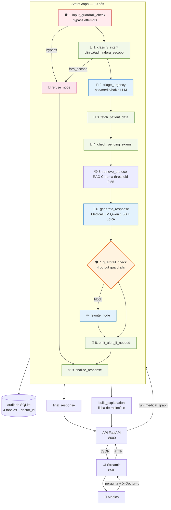

# medical-assistant

Assistente clínico de demonstração, ponta-a-ponta, construído como
Tech Challenge da pós-graduação. Combina um **LLM fine-tuned com dados
médicos**, **RAG** sobre protocolos institucionais sintéticos,
**orquestração via LangGraph**, **guardrails** unificados,
**auditoria** persistida, **explainability** e uma camada **API + UI**
para demonstração.

> ⚠️ Projeto acadêmico, dados sintéticos. **Não usar em decisões clínicas
> reais.** Apoio à decisão exige sempre validação médica.

**Status:** Fases 1 a 7 concluídas. Ver
[histórico das fases](#histórico-das-fases).

---

## Sobre o Projeto

O objetivo é demonstrar, ponta-a-ponta, como construir um assistente de
domínio especializado a partir de um modelo de linguagem de propósito geral:

1. **Fine-tuning local** de um modelo base (Qwen2.5-1.5B-Instruct) com
   dados médicos sintéticos, usando LoRA via `mlx-lm` (treino no Colab,
   inferência no Mac Apple Silicon).
2. **Inferência local** via MLX (Metal) ou Ollama como fallback, sem
   depender de APIs pagas.
3. **RAG** (Retrieval-Augmented Generation) sobre uma base Chroma com
   embeddings multilíngues (`sentence-transformers/paraphrase-multilingual-MiniLM-L12-v2`).
4. **Orquestração via LangGraph** com 10 nós + caminhos condicionais:
   guardrail de entrada → classificação → triagem → busca de paciente
   → exames pendentes → RAG → geração → guardrails de saída
   → emissão de alerta → finalização.
5. **Guardrails unificados** em 5 categorias (prescrição direta, diagnóstico
   definitivo, decisão clínica final, bypass attempt, escopo) com nível
   `block` ou `warning` e reescrita combinada quando necessário.
6. **Auditoria** persistida em SQLite (4 tabelas + CLI de consulta) +
   **explainability** como decomposição pura do state final do grafo
   (sem chamar LLM pra "se explicar").
7. **API FastAPI** + **UI Streamlit** para demonstração no vídeo, com
   `X-Doctor-Id` rastreado no audit DB e modo apresentação.

---

## Arquitetura



**Leitura rápida:** o médico se identifica via header `X-Doctor-Id` na
UI Streamlit. A pergunta vai por HTTP à API FastAPI, que invoca o grafo
LangGraph. O grafo passa por 10 nós (entrada → classificação → triagem
→ paciente → exames → RAG → geração → guardrails → alerta → finalização),
com curto-circuito para `refuse_node` em caso de bypass ou tema fora de
escopo. Cada execução é persistida no audit DB (com `doctor_id`) e uma
ficha de raciocínio é derivada do state final.

Detalhe técnico em [docs/arquitetura_fase6.md](docs/arquitetura_fase6.md)
e diagrama escrito à mão em [docs/langgraph_flow.md](docs/langgraph_flow.md).

---

## Como Rodar

### Pré-requisitos (uma vez)

```bash
# Stack completa (treino exige `data`; demo precisa de api + ui + inference)
uv sync --extra data --extra dev --extra inference --extra api --extra ui
cp .env.example .env       # OPENAI_API_KEY só é usada pra Fase 1 (geração sintética)
```

Para usar apenas a demo (sem regenerar dataset), basta:

```bash
uv sync --extra dev --extra inference --extra api --extra ui
```

### Geração do dataset sintético (Fase 1)

```bash
uv run python -m spacy download pt_core_news_lg
uv run pytest data/test_anonymization.py -v
uv run python data/generate_synthetic.py
uv run python data/prepare_dataset.py
```

### Fine-tuning local (Fase 2, ~30-60 min)

Detalhes em [finetuning/README.md](finetuning/README.md).

```bash
uv run python finetuning/prepare_mlx_dataset.py
uv run python finetuning/train.py --smoke-test   # 2-3 min, valida o setup
uv run python finetuning/train.py                # treino real
uv run python finetuning/evaluate.py
```

### Construir índice RAG e banco de pacientes (uma vez)

Pré-requisito pra qualquer demo da Fase 4 em diante:

```bash
uv run python assistant/rag/build_index.py        # ~30-90s, chunka protocolos + embeda em Chroma
uv run python assistant/tools/build_patient_db.py # ~1s, popula assistant/data/patients.db
```

### Demo via CLI (Fase 5/6 — preferida)

Roda o grafo completo no terminal, com cada nó aparecendo em tempo real
e comandos `/why`, `/trace`, `/state`, `/alerts`:

```bash
uv run python assistant/demo_graph.py
```

Demos históricas das fases anteriores (continuam funcionando):

```bash
# Fase 3 — só LLM + system prompt (sem RAG, sem grafo)
uv run python assistant/demo_chat.py --show-system

# Fase 4 — chain com RAG + tool de paciente (sem grafo)
uv run python assistant/demo_chat.py
```

Detalhes em [assistant/README.md](assistant/README.md).

### Como rodar a demo completa (Fase 7 — recomendada pro vídeo)

API HTTP + UI Streamlit no ar simultaneamente. Pensado pro screencast
do vídeo de 15 min.

```bash
# Sobe API (porta 8000) e UI (porta 8501) em paralelo.
# Ctrl+C derruba os dois.
bash scripts/run_all.sh
```

Quando ver `✨ Tudo no ar`, abra:

- **UI**: <http://localhost:8501>
- **API docs**: <http://localhost:8000/docs>

Detalhes da API em [api/README.md](api/README.md) (endpoints, curl
examples, header `X-Doctor-Id`). Detalhes da UI em
[ui/README.md](ui/README.md) (sidebar, tabs, modo apresentação, paleta
de cores).

Para rodar separadamente:

```bash
# Terminal 1
uv run uvicorn api.server:app --reload --port 8000

# Terminal 2
uv run streamlit run ui/app.py
```

### Histórico das fases

| Fase | Tema | Entregáveis principais |
|---|---|---|
| **1** ✅ | Geração de dataset sintético | `data/synthetic/` (50 pacientes, ~35 protocolos, exames) + anonimização |
| **2** ✅ | Fine-tuning LoRA | adapter em `finetuning/output/adapters` (treino no Colab, MLX-LM) |
| **3** ✅ | LLM wrapper LangChain | `MedicalLLM(BaseChatModel)` + system prompt clínico |
| **4** ✅ | RAG + tool de paciente | Chroma + sentence-transformers; SQLite com prontuários |
| **5** ✅ | Agente LangGraph | StateGraph com 9 nós + refuse + rewrite; logging por nó |
| **6** ✅ | Guardrails + audit + explainability | 5 categorias unificadas, audit.db SQLite (4 tabelas), ficha de raciocínio |
| **7** ✅ | API + UI | FastAPI (6 endpoints) + Streamlit (3 tabs, modo apresentação) |

---

## Testes

```bash
uv run pytest assistant api -m "not slow" -v     # ~302 testes em ~7s
uv run pytest assistant api -m slow              # 5 testes lentos (carrega modelo, ~30s)
```

Quebra por fase:
- **Fases 3-4**: ~26 testes (llm, router, chain, rag)
- **Fase 5**: 46 testes do grafo + 3 slow de integração
- **Fase 6, Bloco 1**: 165 testes dos 5 guardrails + registry
- **Fase 6, Bloco 2**: 29 testes do audit (writer + reader + schema)
- **Fase 6, Bloco 3**: 20 testes da explainability
- **Fase 7**: 14 testes da API (grafo mockado via `dependency_overrides`)

---

## Documentação técnica

Tudo em [`docs/`](docs/) — leia nessa ordem se quiser entender o projeto
do zero:

| Arquivo | Conteúdo |
|---|---|
| [`DECISIONS.md`](DECISIONS.md) | Log das 25 decisões técnicas com o *porquê* de cada uma |
| [`docs/arquitetura_fase4.md`](docs/arquitetura_fase4.md) | RAG + roteador determinístico + chain |
| [`docs/arquitetura_fase5.md`](docs/arquitetura_fase5.md) | LangGraph (9 nós + refuse + rewrite) |
| [`docs/arquitetura_fase6.md`](docs/arquitetura_fase6.md) | Guardrails + audit DB + explainability |
| [`docs/langgraph_flow.md`](docs/langgraph_flow.md) | Diagrama do grafo (escrito à mão, mais legível) |
| [`docs/langgraph_flow.png`](docs/langgraph_flow.png) | Diagrama gerado automaticamente do grafo |
| [`assistant/README.md`](assistant/README.md) | Detalhes do pacote `assistant/` (LLM, RAG, grafo, guardrails, audit) |
| [`api/README.md`](api/README.md) | Endpoints da API + exemplos curl + autenticação simulada |
| [`ui/README.md`](ui/README.md) | UI Streamlit (sidebar, tabs, paleta de cores, roteiro do vídeo) |
| [`finetuning/README.md`](finetuning/README.md) | Pipeline de fine-tuning LoRA (Colab T4) |

---

## Estrutura de Pastas

```
medical-assistant/
├── README.md                ← este arquivo
├── DECISIONS.md             ← log de decisões técnicas (25 entradas)
├── pyproject.toml           ← dependências + config (pytest, ruff, hatch)
├── .env.example             ← variáveis de ambiente (copiar para .env)
├── .gitignore
│
├── data/                    ← Fase 1
│   ├── raw/                 ← datasets crus baixados (não vai pro git)
│   ├── synthetic/           ← pacientes + protocolos + exames sintéticos
│   ├── processed/           ← datasets limpos prontos pra treino
│   ├── anonymization.py     ← spacy + regex pra remover PII
│   └── generate_synthetic.py
│
├── finetuning/              ← Fase 2 (treino no Colab T4)
│   ├── configs/             ← YAMLs com hiperparâmetros
│   ├── output/adapters/     ← adapter LoRA treinado (não vai pro git)
│   ├── prepare_mlx_dataset.py
│   ├── train.py
│   └── evaluate.py
│
├── assistant/               ← Fases 3-6 (núcleo do agente)
│   ├── llm.py               ← MedicalLLM (BaseChatModel + MLX backend)
│   ├── prompts.py           ← system prompt clínico (default + strict)
│   ├── rag/                 ← Fase 4 — Chroma + retriever
│   ├── tools/               ← Fase 4 — patient_records, build_patient_db
│   ├── chain.py             ← Fase 4 — chain LangChain (referência)
│   ├── graph_state.py       ← Fase 5 — MedicalState TypedDict
│   ├── graph_nodes.py       ← Fase 5 — 10 nós + refuse + rewrite
│   ├── graph.py             ← Fase 5 — build_graph, run_medical_graph
│   ├── guardrails/          ← Fase 6, Bloco 1 — 5 categorias + registry
│   ├── audit/               ← Fase 6, Bloco 2 — writer, reader, CLI
│   ├── explainability.py    ← Fase 6, Bloco 3 — ficha de raciocínio
│   ├── demo_chat.py         ← demo Fase 3/4 (chain)
│   ├── demo_graph.py        ← demo Fase 5/6 (grafo + /why)
│   └── data/                ← chroma_db + patients.db (não vai pro git)
│
├── api/                     ← Fase 7 — backend FastAPI
│   ├── server.py            ← app + lifespan + 6 endpoints
│   ├── schemas.py           ← Pydantic request/response
│   ├── dependencies.py      ← X-Doctor-Id, AuditReader, GraphRunner
│   └── test_endpoints.py    ← 14 testes com grafo mockado
│
├── ui/                      ← Fase 7 — frontend Streamlit
│   ├── app.py               ← entry: sidebar + 3 tabs
│   ├── client.py            ← wrapper httpx pra API
│   ├── styles.py            ← CSS + paleta + modo apresentação
│   └── components/          ← consult_tab, audit_tab, about_tab
│
├── scripts/
│   └── run_all.sh           ← sobe API + UI em paralelo (Ctrl+C derruba)
│
├── evaluation/              ← scripts de avaliação automatizada
│   ├── eval_system_prompt.py    ← Fase 3
│   ├── eval_rag.py              ← Fase 4
│   ├── eval_graph.py            ← Fase 5 (10 casos, 10/10)
│   └── eval_guardrails.py       ← Fase 6 (30 casos, 30/30)
│
├── docs/                    ← documentação técnica complementar
├── logging_/                ← logs + audit.db (não vai pro git)
│   ├── alerts.jsonl
│   ├── graph_traces.jsonl
│   └── audit.db             ← SQLite com 4 tabelas (interactions, etc.)
└── notebooks/               ← notebooks Jupyter (treino no Colab)
```

> O `_` em `logging_/` evita conflito com o módulo `logging` da biblioteca
> padrão do Python.
