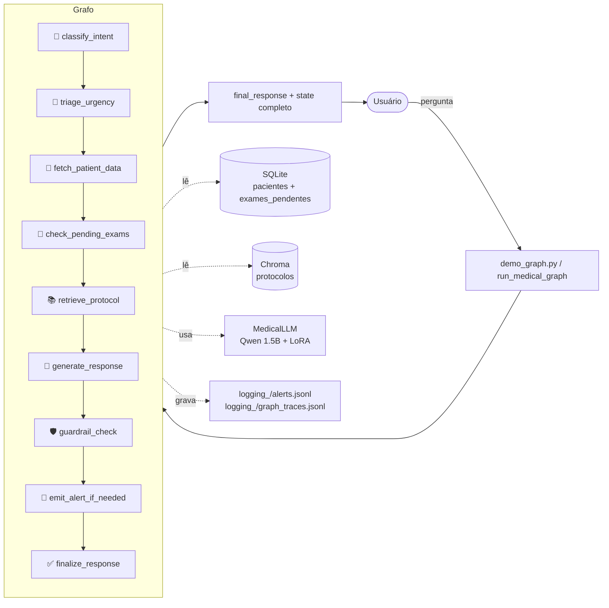

# Arquitetura — Fase 5

Estado do sistema após a Fase 5: a **chain LangChain** da Fase 4 foi
substituída por um **grafo LangGraph** com 9 nós + 2 auxiliares. O grafo
torna o fluxo explícito, com estado compartilhado, logging por nó, e
diagrama exportável.

A chain da Fase 4 (`assistant/chain.py`) continua existindo como
referência — mas o orquestrador oficial é agora o grafo.

---

## Fluxo de uma pergunta (alto nível)



Diagrama detalhado (com nós condicionais e ramificações):
ver [`langgraph_flow.md`](langgraph_flow.md).

---

## Decisões-chave da Fase 5

| Decisão | Por quê | Onde |
|---|---|---|
| **LangGraph + TypedDict** | Fluxo explícito, estado auditável, observabilidade por nó | `assistant/graph_state.py`, `graph.py` |
| **Reducers `operator.add`** | `node_trace`, `errors`, `alerts_emitted` precisam acumular, não sobrescrever | `graph_state.py:MedicalState` |
| **Híbrido determinístico/LLM nos classificadores** | LoRA enviesa Nó 1 (`clinica` sempre); Nó 2 funciona bem com LLM | `intent_classifier.py`, `graph_nodes.py` |
| **Nós defensivos (try/except + fallback)** | Demo do vídeo precisa funcionar; erros não-fatais são estados esperados | padrão em `graph_nodes.py` |
| **Alertas em arquivo (jsonl)** | Schema estável pra Fase 7 plugar destinos reais; sem dependência externa agora | `graph_nodes.py:emit_alert_if_needed` |
| **2 tabelas exames** | Nova `exames_pendentes` (estruturada) coexiste com coluna JSON legada (Fase 4) | `build_patient_db.py`, `patient_records.py` |
| **Demo realtime via log handler** | Em vez de `astream` (complexo), capturamos logs de `assistant.graph_nodes` com prefixo `[node]` e printamos colorido | `demo_graph.py:GraphNodeLogHandler` |
| **2 diagramas** | Auto-gerado dá fidelidade ao código real; escrito à mão é legível pro relatório | `docs/langgraph_flow_auto.md`, `langgraph_flow.md` |

Cada uma dessas decisões está documentada em detalhe no
[`DECISIONS.md`](../DECISIONS.md) (entradas 18–21).

---

## Estrutura de arquivos (novos / alterados)

```
medical-assistant/
├── assistant/
│   ├── graph_state.py          ← NOVO: MedicalState TypedDict + reducers
│   ├── graph_prompts.py        ← NOVO: prompts dos nós (triage, generate, rewrite, refuse)
│   ├── intent_classifier.py    ← NOVO: classificador determinístico (Nó 1)
│   ├── graph_nodes.py          ← NOVO: 9 nós + refuse + rewrite
│   ├── graph.py                ← NOVO: build_graph + run_medical_graph + export_diagram
│   ├── demo_graph.py           ← NOVO: CLI interativo do grafo
│   ├── test_graph_nodes.py     ← NOVO: 42 testes unitários (~1s)
│   ├── test_graph_integration.py  ← NOVO: 3 testes end-to-end (slow)
│   ├── test_classifier_prompts.py ← NOVO: validação manual dos prompts
│   ├── tools/
│   │   ├── build_patient_db.py ← MODIFICADO: nova tabela exames_pendentes + seed
│   │   └── patient_records.py  ← MODIFICADO: get_pending_exams()
│   ├── chain.py                ← MANTIDO (Fase 4) como referência
│   ├── demo_chat.py            ← MANTIDO (Fase 4) como referência
│   ├── llm.py                  ← MANTIDO
│   ├── prompts.py              ← MANTIDO
│   ├── router.py               ← MANTIDO (usado pelo grafo p/ extrair patient_id)
│   ├── rag/                    ← MANTIDO
│   └── data/patients.db        ← REGERADO: agora com tabela exames_pendentes
├── evaluation/
│   ├── eval_graph.py           ← NOVO: 10 casos de avaliação
│   ├── graph_eval_results.md   ← NOVO: relatório de avaliação
│   └── graph_traces/case_NN.json ← NOVO: trace por caso
├── docs/
│   ├── arquitetura_fase5.md    ← NOVO (este arquivo)
│   ├── langgraph_flow.md       ← NOVO: diagrama escrito à mão
│   ├── langgraph_flow_auto.md  ← NOVO: diagrama auto-gerado
│   └── langgraph_flow.png      ← NOVO: PNG via mermaid.ink
├── logging_/
│   ├── alerts.jsonl            ← NOVO: 1 linha por alerta de urgência alta
│   └── graph_traces.jsonl      ← NOVO: 1 linha por execução do grafo
└── DECISIONS.md                ← MODIFICADO: +4 entradas (18-21)
```

---

## Como rodar

```bash
cd medical-assistant

# Construir DB com a nova tabela (idempotente)
uv run python assistant/tools/build_patient_db.py

# Smoke test do grafo + exportar diagrama
uv run python assistant/graph.py

# Demo interativo (substitui demo_chat.py p/ Fase 5)
uv run python assistant/demo_graph.py

# Testes unitários (rápido, ~1s)
uv run pytest assistant/test_graph_nodes.py -v

# Testes de integração (lento, carrega modelo)
uv run pytest assistant/test_graph_integration.py -v -m slow -s

# Avaliação end-to-end (10 casos)
uv run python evaluation/eval_graph.py
```

---

## Próximas fases

- **Fase 6**: Guardrails programáticos sofisticados (LLM-as-judge,
  validação de claims contra protocolos, auditoria de explainability).
- **Fase 7**: API FastAPI expõe `run_medical_graph()` via HTTP,
  Streamlit como UI. Nó 8 ganha sink plugável (Slack/email/webhook).
