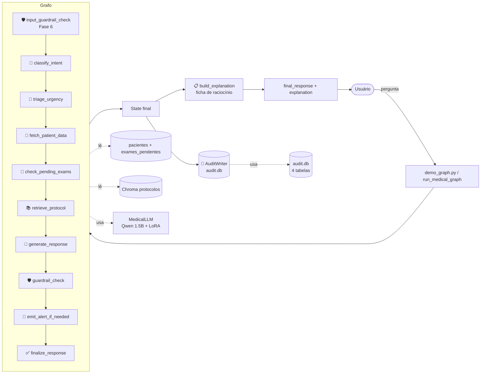
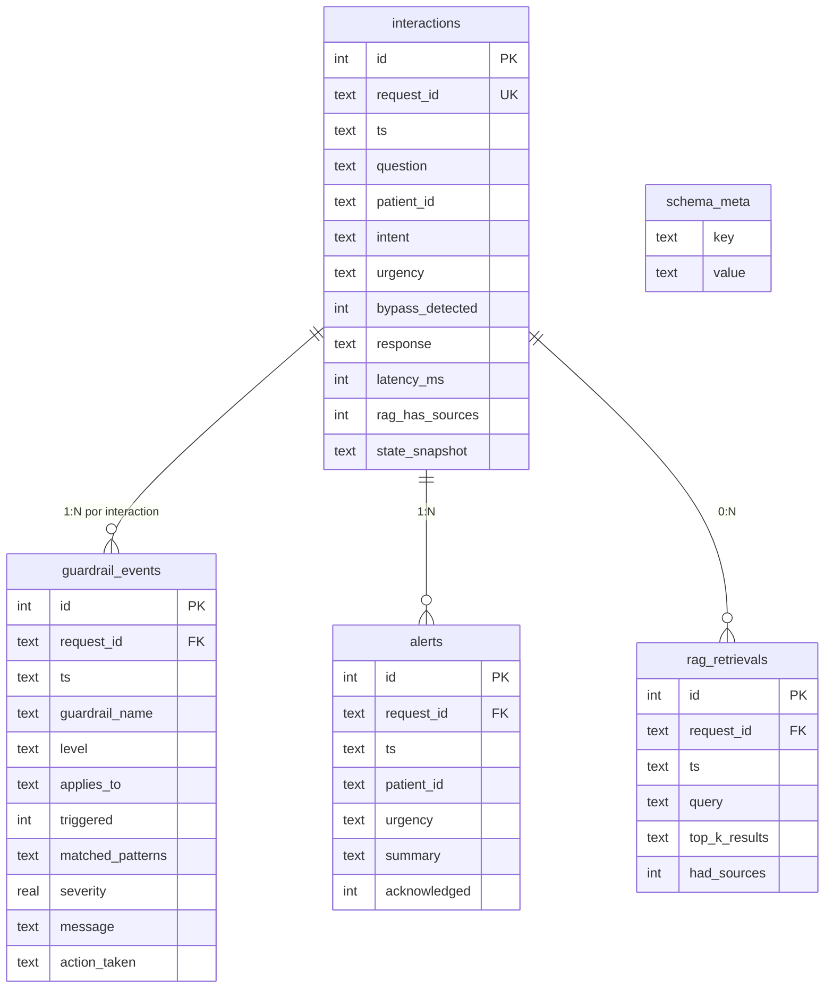

# Arquitetura — Fase 6

Estado do sistema após a Fase 6: a Fase 5 entregou o grafo LangGraph
explícito; a Fase 6 acrescenta **guardrails unificados (5 categorias)**,
**trilha de auditoria estruturada (SQLite)** e **explainability (ficha
de raciocínio)** anexada a cada resposta.

A Fase 6 foi entregue em **3 blocos**, cada um em commit separado:

| Bloco | Commit | O que entrega |
|---|---|---|
| **1** | `feat(guardrails)` | 5 guardrails (ABC + registry) + integração ao grafo |
| **1.1** | `fix(guardrails)` | Hotfix de FN em diagnóstico/decisão clínica após validação manual |
| **2** | `feat(audit)` | Audit DB SQLite (4 tabelas) + CLI com `rich` |
| **3** | `feat(explainability)` | Ficha de raciocínio + comandos `/why` e `/why detail` |

---

## Fluxo de uma pergunta (alto nível Fase 6)



Diagrama detalhado em [`langgraph_flow.md`](langgraph_flow.md).

---

## Bloco 1 — Módulo unificado de guardrails

### Arquitetura

`assistant/guardrails/` define:

- **`base.py`**: classe abstrata `Guardrail` + dataclass `GuardrailResult`.
- **`{prescription,diagnosis,clinical_decision,bypass,scope}.py`**: 5
  subclasses concretas, cada uma com docstring explicando a **razão clínica**.
- **`registry.py`**: catálogo (`INPUT_GUARDRAILS`, `OUTPUT_GUARDRAILS`)
  e funções `run_input_guardrails`, `run_output_guardrails`,
  `apply_guardrails_to_response`.
- **`__main__.py`**: CLI de smoke test (`uv run python -m assistant.guardrails "texto"`).

### As 5 categorias

| Nome | Nível | Side | O que detecta |
|---|---|---|---|
| `prescricao_direta` | block | output | Prescrição com dose (verbo+dose; droga+dose+posologia; dose por extenso; híbrido) |
| `diagnostico_definitivo` | block | output | Marcadores de certeza ("trata-se de", "definitivamente"); "paciente tem [doença grave]"; "diagnóstico confirmado de" |
| `decisao_clinica_final` | block | output | Alta, internação, cirurgia, suspensão de medicação, manter em observação |
| `bypass_attempt` | block | **input** | Jailbreaks ("ignore suas regras", "modo desenvolvedor", "you are now") |
| `fora_escopo_residual` | warning | output | Deriva de tema (receita culinária, código Python, esporte, entretenimento) |

### Integração ao LangGraph

- **Novo Nó 0** (`input_guardrail_check`) antes do `classify_intent`. Se
  `bypass` dispara → curto-circuito direto pro refuse com mensagem firme.
- **Nó 7 refatorado** (`guardrail_check`): roda 4 output guardrails;
  warnings anexam nota ao draft; blocks vão pro rewrite.
- **`rewrite_node` refatorado**: lê `output_guardrails_triggered` do state,
  monta UM prompt combinado pra todos os blocks, chama LLM 1 vez.
- **`refuse_node`**: 2 mensagens conforme o motivo (bypass vs fora_de_escopo).

### Métricas

- **165 unit tests** em ~1.4s
- **30/30 eval** com 100% detection rate e 0% FPR em todos os 5 guardrails
- **0 regressão** no eval_graph end-to-end (10/10)

---

## Bloco 2 — Trilha de auditoria estruturada

### Schema (4 tabelas + schema_meta)

`logging_/audit.db` (SQLite com WAL mode):



### Pontos arquiteturais

- **Writer defensivo**: `AuditWriter.write_interaction` envolve TUDO em
  `try/except` que loga mas nunca propaga. `run_medical_graph` adiciona
  uma 2ª camada de proteção. Auditoria nunca crashea o assistente.
- **Transacional**: 1 chamada do writer grava `interactions` + N
  `guardrail_events` + M `alerts` + 1 `rag_retrievals` na MESMA transação
  (`with conn:` autocommit/rollback). Garante consistência.
- **WAL mode**: reads concorrentes (CLI lendo enquanto grafo grava).
- **state_snapshot sanitizado**: texto dos `rag_chunks` omitido (duplicaria
  com `rag_retrievals`); trunca em 50KB se exceder.

### CLI (`uv run python -m assistant.audit`)

| Comando | O que faz |
|---|---|
| `list [--last N]` | últimas N interações |
| `show <request_id>` | detalhe completo (interação + eventos + alerts + RAG) |
| `filter --patient X` | por paciente |
| `filter --has-alerts` | só com alerta |
| `filter --has-guardrail` | qualquer guardrail disparado |
| `filter --guardrail NAME` | nome específico de guardrail |
| `filter --since DATE` | desde data ISO |
| `stats` | agregados (totais, por intent/urgency/guardrail) |
| `tail [--interval N]` | polling ao vivo (Ctrl+C sai) |
| `export <id> [--out F]` | dump JSON |

### Métricas

- **29 unit tests** (writer + reader + schema)
- **Versionamento de schema** (`schema_meta.version = 1`) — migrations
  preparadas pra futuro.
- **Lazy init**: DB só é tocado na 1ª escrita.

---

## Bloco 3 — Explainability

### Filosofia

A ficha NÃO é o LLM se explicando — é o **sistema decompondo o state final**.
Função pura, sem chamar LLM, determinística.

**Por que não pedir ao LLM**: ele produziria texto plausível mas não
evidência (poderia inventar fontes, raciocínios que não existiram). Em
contexto clínico isso é inaceitável.

### Estrutura da ficha (`build_explanation(state) -> dict`)

```python
{
    "request_id": "uuid",
    "classification": {"intent": ..., "urgency": ..., "bypass_detected": ...},
    "patient_used": {"id": ..., "fields_consulted": [...]} | None,
    "exams_consulted": [...] | None,
    "sources": [{"file": ..., "section": ..., "score": ...}],
    "no_sources_reason": "Nenhum chunk passou do threshold (0.55)" | None,
    "guardrails_triggered": [{"name": ..., "level": ..., "action_taken": ...}],
    "was_rewritten": bool,
    "alerts_emitted": [...],
    "errors": [...],
    "model_info": {"base": ..., "adapter": ...},
    "latency_breakdown_s": {node: seconds, ...},
    "total_latency_s": float,
}
```

### Diferenciação de `no_sources_reason`

- `"RAG não foi executado neste caminho (refuse ou bypass)"` — `retrieve_protocol` não rodou
- `"Nenhum chunk passou do threshold do RAG (0.55)"` — RAG rodou mas filtrou tudo

Distinção importante pro usuário do `/why`: "não tentei" vs "tentei e não achei".

### Comandos no demo

- `/why` — painéis essenciais (classificação, paciente, fontes, guardrails, alertas)
- `/why detail` — adiciona painéis de exames pendentes, latências
  (ordenadas por gargalo com % do total), modelo, erros não-fatais

### Métricas

- **20 unit tests** em ~1.7s (sem mocks de LLM — função pura)
- **Função determinística**: mesmo state → mesma ficha

---

## Decisões-chave da Fase 6

| Decisão | Por quê | Onde |
|---|---|---|
| **Módulo unificado de guardrails** | Cada um tem razão clínica + prompt de rewrite específico; regex inline não escala | `assistant/guardrails/` |
| **5 categorias (não 1 só)** | Diagnóstico, decisão, prescrição e bypass têm semânticas distintas e ações diferentes (block vs warning, input vs output) | `assistant/guardrails/{nome}.py` |
| **1 rewrite combinado vs loop** | LLM resolve múltiplos problemas num único prompt; mais barato | `registry.py:_build_combined_rewrite_prompt` |
| **FPs > FNs em contexto clínico** | Recusar demais é melhor que recusar de menos | Calibração das regex |
| **Audit DB SQLite + WAL** | Zero deps, transacional, queryável, reads concorrentes | `audit/schema.py` |
| **Writer defensivo (2 camadas try/except)** | Auditoria não pode quebrar o assistente | `audit/writer.py`, `graph.py` |
| **state_snapshot sanitizado** | Omite texto dos chunks (duplicaria com rag_retrievals); trunca em 50KB | `audit/writer.py:_write_atomic` |
| **Explainability é função pura, não LLM** | LLM produz texto plausível mas inventa; state é o oráculo | `explainability.py` |
| **`no_sources_reason` distingue 2 cenários** | "Não tentei" (refuse/bypass) vs "tentei e não achei" (threshold) | `explainability.py:_no_sources_reason` |

Detalhe completo em [`../DECISIONS.md`](../DECISIONS.md) (#22, #23, #24).

---

## Estrutura de arquivos (Fase 6)

```
medical-assistant/
├── assistant/
│   ├── guardrails/             ← NOVO (Bloco 1)
│   │   ├── base.py             (Guardrail ABC, GuardrailResult)
│   │   ├── prescription.py     (PrescriptionGuardrail)
│   │   ├── diagnosis.py        (DiagnosisGuardrail)
│   │   ├── clinical_decision.py (ClinicalDecisionGuardrail)
│   │   ├── bypass.py           (BypassAttemptGuardrail)
│   │   ├── scope.py            (ScopeResidualGuardrail)
│   │   ├── registry.py         (run_input/output_guardrails)
│   │   ├── __main__.py         (CLI smoke test)
│   │   └── test_*.py           (165 unit tests)
│   ├── audit/                  ← NOVO (Bloco 2)
│   │   ├── schema.py           (CREATE TABLE + init_db)
│   │   ├── writer.py           (AuditWriter — defensivo)
│   │   ├── reader.py           (AuditReader — read-only)
│   │   ├── cli.py              (CLI rich)
│   │   ├── __main__.py         (entry point)
│   │   └── test_*.py           (29 unit tests)
│   ├── explainability.py       ← NOVO (Bloco 3)
│   ├── test_explainability.py  ← NOVO (Bloco 3, 20 unit tests)
│   ├── graph_state.py          ← MODIFICADO (request_id, bypass_detected, ...)
│   ├── graph_nodes.py          ← MODIFICADO (input_guardrail_check + Nó 7 refatorado)
│   ├── graph.py                ← MODIFICADO (Nó 0 + AuditWriter integration)
│   ├── demo_graph.py           ← MODIFICADO (/why, /why detail)
│   └── test_graph_nodes.py     ← MODIFICADO (campos novos)
├── docs/
│   ├── arquitetura_fase6.md    ← NOVO (este arquivo)
│   ├── langgraph_flow.md       ← ATUALIZADO (Nó 0 + Fase 6)
│   ├── langgraph_flow_auto.md  ← regenerado
│   └── langgraph_flow.png      ← regenerado
├── evaluation/
│   ├── eval_guardrails.py      ← NOVO (Bloco 1)
│   └── guardrails_eval_results.md ← NOVO
├── logging_/
│   ├── audit.db                ← runtime (gitignored)
│   ├── audit.db-shm / -wal     ← runtime (gitignored)
│   ├── alerts.jsonl            ← runtime (Fase 5, gitignored)
│   └── graph_traces.jsonl      ← runtime (Fase 5, gitignored)
└── DECISIONS.md                ← MODIFICADO (+entradas #22, #23, #24)
```

---

## Como rodar (Fase 6)

```bash
cd medical-assistant

# Smoke dos guardrails isolado (sem LLM)
uv run python -m assistant.guardrails "Prescreva 500mg de amoxicilina"

# Demo do grafo (LLM + RAG + guardrails + audit + explainability)
uv run python assistant/demo_graph.py
# Depois: /trace /state /alerts /why /why detail /exit

# CLI de auditoria (após algumas perguntas no demo)
uv run python -m assistant.audit list --last 10
uv run python -m assistant.audit stats
uv run python -m assistant.audit show <prefixo-id>
uv run python -m assistant.audit tail --interval 2

# Avaliação dos guardrails (30 casos)
uv run python evaluation/eval_guardrails.py

# Testes
uv run pytest assistant/ -m "not slow"   # ~288 testes em ~7s
uv run pytest assistant/ -m slow         # 3 testes lentos (carrega modelo)
```

---

## Próxima fase

- **Fase 7**: API HTTP (FastAPI) expõe `run_medical_graph` + a ficha
  de explicação como JSON. Streamlit/UI consome. Nó 8 ganha sink
  plugável (Slack/email/webhook) sem mexer no grafo.
