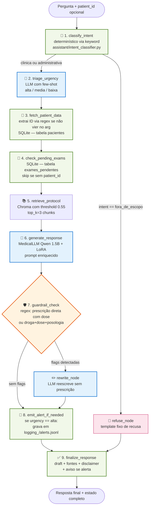

# Diagrama do grafo LangGraph — Fase 5

Versão **escrita à mão** (mais legível pro relatório e vídeo).
A versão auto-gerada pelo `draw_mermaid()` está em
[`langgraph_flow_auto.md`](langgraph_flow_auto.md) e a renderização
PNG em [`langgraph_flow.png`](langgraph_flow.png).

---

## Fluxo de uma pergunta

---

## Legenda

| Cor | Tipo | Nós |
|---|---|---|
| 🟢 Verde | Determinístico (sem LLM) | 1, 3, 4, 8, 9 |
| 🔵 Azul | LLM (Qwen 1.5B + LoRA) | 2, 6, rewrite |
| 🟠 Laranja | Gateway (roteamento condicional) | 7 |
| 🌸 Rosa | Short-circuit de recusa | refuse_node |

---

## Estado compartilhado entre os nós

O grafo passa um `MedicalState` (TypedDict) que cada nó recebe e ao
qual cada nó devolve um dict parcial. LangGraph faz o merge automático
via reducers (`operator.add` nos campos acumulativos).

### Campos principais

| Campo | Tipo | Quem preenche |
|---|---|---|
| `question` | str | entrada |
| `patient_id` | str \| None | entrada OU Nó 3 (regex) |
| `intent` | "clinica" \| "administrativa" \| "fora_de_escopo" | Nó 1 |
| `urgency` | "alta" \| "media" \| "baixa" | Nó 2 |
| `patient_data` | dict \| None | Nó 3 |
| `pending_exams` | list[dict] \| None | Nó 4 |
| `rag_chunks`, `rag_has_sources` | list[dict], bool | Nó 5 |
| `draft_response` | str | Nó 6 ou rewrite |
| `guardrail_flags` | list[str] (acumulado) | Nó 7 |
| `was_rewritten` | bool | rewrite_node |
| `final_response` | str | Nó 9 |
| `alerts_emitted` | list[dict] (acumulado) | Nó 8 |
| `node_trace` | list[dict] (acumulado) | todos |
| `errors` | list[str] (acumulado) | qualquer um |

### Reducers acumulativos

Campos marcados como `Annotated[list, operator.add]` são **concatenados**
em vez de substituídos quando um nó os retorna. Isso é essencial para
`node_trace` (cada nó adiciona 1 entrada) e `errors` (vários nós podem
registrar problemas não-fatais).

---

## Caminhos possíveis pelo grafo

| Cenário | Trace típico | # de nós |
|---|---|---|
| Pergunta clínica sem paciente, sem prescrição | 1 → 2 → 3 (skip) → 4 (skip) → 5 → 6 → 7 → 8 → 9 | 9 |
| Pergunta clínica com paciente | 1 → 2 → 3 → 4 → 5 → 6 → 7 → 8 → 9 | 9 |
| Urgência alta | mesmo acima, mas 8 grava alerta | 9 |
| Resposta enviesada a prescrever | … → 6 → 7 (flag) → rewrite → 8 → 9 | 10 |
| Pergunta fora de escopo | 1 → refuse → 9 | 3 |
| Paciente inexistente | 1 → 2 → 3 (erro) → 4 → 5 → 6 → 7 → 8 → 9 | 9 |

---

## Observabilidade

Cada nó:

1. Loga no `logger` do módulo (`assistant.graph_nodes`) com formato
   `[node_name] mensagem`. O `demo_graph.py` captura esses logs em
   tempo real pra mostrar o nó executando.
2. Adiciona 1 entrada em `state.node_trace` com `timestamp`,
   `latency_s` e um `summary` curto.
3. Em caso de exceção, captura e registra em `state.errors` (não
   propaga — o grafo nunca crasha).

### Logs estruturados em disco

- `logging_/graph_traces.jsonl` — 1 linha por execução do grafo (state final resumido)
- `logging_/alerts.jsonl` — 1 linha por alerta emitido (urgência alta)

---

## Diferença em relação à Fase 4

Na Fase 4, a orquestração era feita por um `RunnableLambda` em
`assistant/chain.py` que chamava `route() → retrieve() → llm.invoke()`
em sequência. O fluxo era linear e implícito.

Na Fase 5, o `StateGraph` torna o fluxo **explícito e auditável**:

- Cada decisão é um nó com nome próprio.
- O estado é compartilhado e rastreável.
- Roteamento condicional é declarativo (`add_conditional_edges`).
- Logging por nó vem "de graça".
- Adicionar uma nova etapa é mais barato (1 nó, 1 edge).

A chain da Fase 4 continua existindo como referência —
`uv run python -c "from assistant.chain import build_default_chain"`
ainda funciona, mas o orquestrador oficial agora é o grafo.
