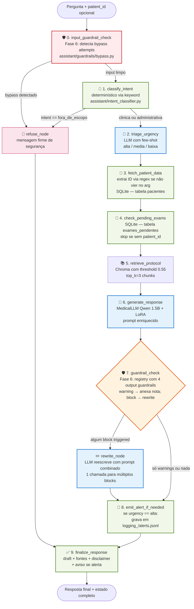
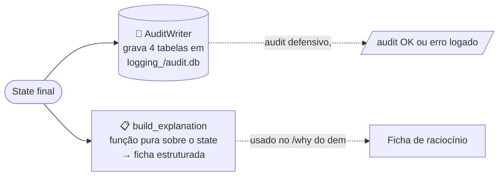

# Diagrama do grafo LangGraph — Fase 6

Versão **escrita à mão** (mais legível pro relatório e vídeo).
A versão auto-gerada pelo `draw_mermaid()` está em
[`langgraph_flow_auto.md`](langgraph_flow_auto.md) e a renderização
PNG em [`langgraph_flow.png`](langgraph_flow.png).

> **Mudança Fase 6**: adicionado o **Nó 0** (`input_guardrail_check`) antes do
> classify_intent. O Nó 7 (`guardrail_check`) foi reescrito pra usar o
> registry de guardrails (5 categorias). Detalhes em
> [`arquitetura_fase6.md`](arquitetura_fase6.md).

---

## Fluxo de uma pergunta

---

## Legenda

| Cor | Tipo | Nós |
|---|---|---|
| 🟢 Verde | Determinístico (sem LLM) | 1, 3, 4, 8, 9 |
| 🔵 Azul | LLM (Qwen 1.5B + LoRA) | 2, 6, rewrite |
| 🟠 Laranja | Gateway (roteamento condicional) | 7 |
| 🔴 Vermelho | Guardrail input-side (segurança) | **0 (Fase 6)** |
| 🌸 Rosa | Short-circuit de recusa | refuse_node |

---

## Pós-grafo: auditoria + explainability (Fase 6)

Após o grafo terminar, o `run_medical_graph` faz mais duas operações,
fora do `StateGraph`:

- **AuditWriter**: chamada DEFENSIVA — exceção é logada mas não propaga.
- **build_explanation**: função pura, não chama LLM, determinística.

---

## Estado compartilhado entre os nós

O grafo passa um `MedicalState` (TypedDict) que cada nó recebe e ao
qual cada nó devolve um dict parcial. LangGraph faz o merge automático
via reducers (`operator.add` nos campos acumulativos).

### Campos principais (atualizados Fase 6)

| Campo | Tipo | Quem preenche |
|---|---|---|
| `request_id` | str (UUID) | `initial_state` (Fase 6 — chave de audit) |
| `question` | str | entrada |
| `patient_id` | str \| None | entrada OU Nó 3 (regex) |
| `bypass_detected` | bool | Nó 0 (Fase 6) |
| `input_guardrails_triggered` | list[dict] | Nó 0 (Fase 6) |
| `intent` | "clinica" \| "administrativa" \| "fora_de_escopo" | Nó 1 |
| `urgency` | "alta" \| "media" \| "baixa" | Nó 2 |
| `patient_data` | dict \| None | Nó 3 |
| `pending_exams` | list[dict] \| None | Nó 4 |
| `rag_chunks`, `rag_has_sources` | list[dict], bool | Nó 5 |
| `draft_response` | str | Nó 6 ou rewrite |
| `output_guardrails_triggered` | list[dict] | Nó 7 (Fase 6 — substitui `guardrail_flags`) |
| `final_response` | str | Nó 9 |
| `alerts_emitted` | list[dict] (acumulado) | Nó 8 |
| `node_trace` | list[dict] (acumulado) | todos |
| `errors` | list[str] (acumulado) | qualquer um |

### Reducers acumulativos

Campos `Annotated[list, operator.add]` são **concatenados**:
`node_trace`, `errors`, `alerts_emitted`.

**Fase 6** removeu o reducer de `input_guardrails_triggered` e
`output_guardrails_triggered` — esses campos são escritos UMA VEZ
(replace) pelos nós 0 e 7 respectivamente; o `rewrite_node` retorna a
lista atualizada com `action_taken="rewritten"`, e replace é o
comportamento correto (add duplicaria).

---

## Caminhos possíveis pelo grafo

| Cenário | Trace típico | # de nós |
|---|---|---|
| Pergunta clínica sem paciente, sem disparo | 0 → 1 → 2 → 3 (skip) → 4 (skip) → 5 → 6 → 7 → 8 → 9 | 10 |
| Pergunta clínica com paciente | 0 → 1 → 2 → 3 → 4 → 5 → 6 → 7 → 8 → 9 | 10 |
| Urgência alta | mesmo acima, Nó 8 grava alerta | 10 |
| Resposta com prescrição → reescrita | … → 6 → 7 (block) → rewrite → 8 → 9 | 11 |
| Bypass detectado (Fase 6) | 0 (bypass) → refuse → 9 | 3 |
| Pergunta fora de escopo | 0 → 1 (fora) → refuse → 9 | 4 |
| Paciente inexistente | 0 → 1 → 2 → 3 (erro) → 4 → 5 → 6 → 7 → 8 → 9 | 10 |

---

## Observabilidade (Fase 5) + Auditoria (Fase 6)

Cada nó:

1. Loga no `logger` do módulo (`assistant.graph_nodes`) com formato
   `[node_name] mensagem`. O `demo_graph.py` captura esses logs em
   tempo real pra mostrar o nó executando.
2. Adiciona 1 entrada em `state.node_trace` com `timestamp`,
   `latency_s` e um `summary` curto.
3. Em caso de exceção, captura e registra em `state.errors` (não
   propaga — o grafo nunca crasha).

### Persistência (camadas)

- `logging_/graph_traces.jsonl` — 1 linha por execução do grafo (Fase 5)
- `logging_/alerts.jsonl` — 1 linha por alerta de urgência alta (Fase 5)
- **`logging_/audit.db`** — SQLite com 4 tabelas (Fase 6, Bloco 2):
  - `interactions`, `guardrail_events`, `alerts`, `rag_retrievals`
  - Queryável via `uv run python -m assistant.audit ...`

---

## Diferença em relação às fases anteriores

**Fase 4 → Fase 5**: orquestração via `RunnableLambda` virou
`StateGraph` explícito (9 nós + refuse + rewrite).

**Fase 5 → Fase 6**:
- Adicionado **Nó 0** (`input_guardrail_check`) — single bypass detector,
  curto-circuito direto pro refuse.
- Nó 7 (`guardrail_check`) refatorado: agora usa registry com 5 guardrails
  (4 output-side + 1 input-side já no Nó 0).
- `rewrite_node` agora endereça MÚLTIPLOS blocks num único prompt combinado.
- `refuse_node` ganhou 2 mensagens: bypass (firme) vs fora_de_escopo (educada).
- State ganhou: `request_id`, `bypass_detected`,
  `input_guardrails_triggered`, `output_guardrails_triggered`.
- `run_medical_graph` invoca `AuditWriter` ao final (gravação defensiva).
- Função `build_explanation(state)` derive a ficha pro `/why` no demo.

A chain da Fase 4 continua existindo como referência —
`uv run python -c "from assistant.chain import build_default_chain"`
ainda funciona, mas o orquestrador oficial é o grafo da Fase 5/6.
