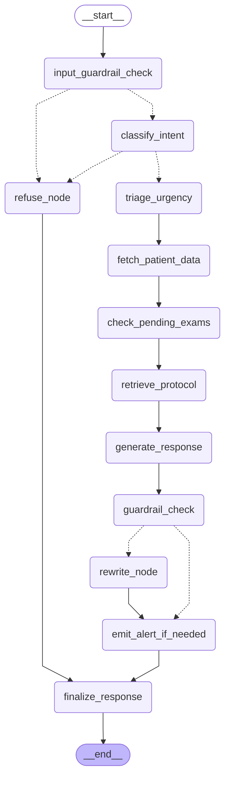

# Diagrama do grafo — gerado automaticamente

Este arquivo é gerado por `assistant/graph.py:export_diagram()`.
Para a versão escrita à mão (mais legível pro relatório), veja [`langgraph_flow.md`](langgraph_flow.md).

