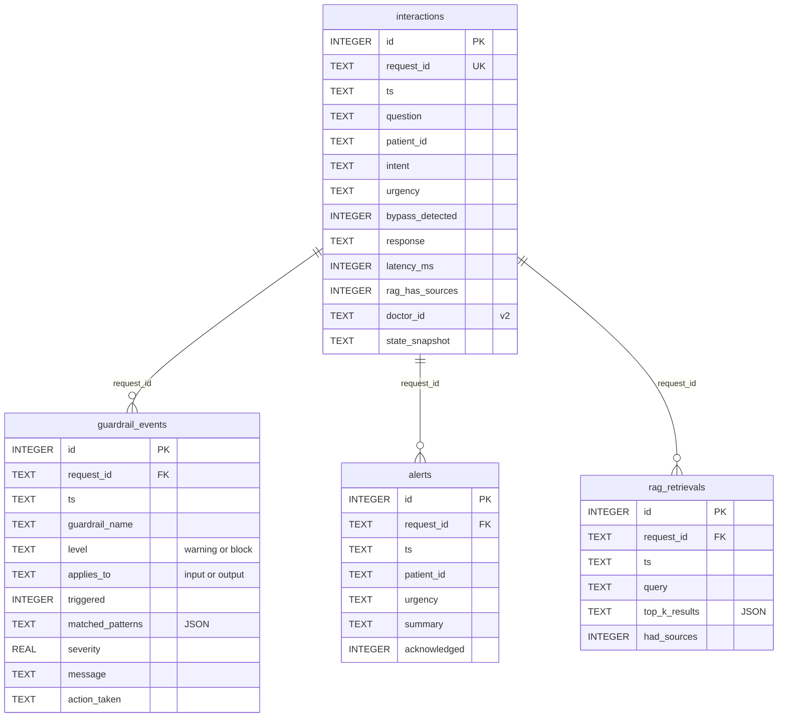

# Apêndice G — Schema do audit DB

Schema completo, idempotente, em SQLite com WAL mode. Arquivo-fonte:
[`assistant/audit/schema.py`](../../../assistant/audit/schema.py).

## Resumo

| Tabela | Propósito | Cardinalidade por interação |
|---|---|---|
| `interactions` | 1 linha por chamada de `run_medical_graph` | 1 |
| `guardrail_events` | 1 linha por guardrail avaliado (triggered ou não) | N (5 default) |
| `alerts` | 1 linha por alerta de urgência alta emitido | 0 ou 1 |
| `rag_retrievals` | 1 linha por execução do nó `retrieve_protocol` | 0 ou 1 |
| `schema_meta` | Versionamento do schema (`version`) | 1 fixo |

## Versionamento

- **v1** (Fase 6) — schema original
- **v2** (Fase 7) — coluna `doctor_id TEXT` adicionada via `ALTER TABLE`
  idempotente em `interactions` para rastrear o header `X-Doctor-Id`
  recebido pela API.

A função `init_db()` é idempotente: pode ser chamada em DB inexistente
(cria tudo) ou DB v1 (aplica `ALTER TABLE` se a coluna ainda não existe).

## Diagrama ERD



## DDL completo

```sql
CREATE TABLE IF NOT EXISTS schema_meta (
    key TEXT PRIMARY KEY,
    value TEXT NOT NULL
);

CREATE TABLE IF NOT EXISTS interactions (
    id INTEGER PRIMARY KEY AUTOINCREMENT,
    request_id TEXT UNIQUE NOT NULL,
    ts TEXT NOT NULL,
    question TEXT NOT NULL,
    patient_id TEXT,
    intent TEXT,
    urgency TEXT,
    bypass_detected INTEGER NOT NULL DEFAULT 0,
    response TEXT,
    latency_ms INTEGER,
    rag_has_sources INTEGER,
    doctor_id TEXT,             -- v2 (Fase 7)
    state_snapshot TEXT
);
CREATE INDEX IF NOT EXISTS idx_interactions_ts      ON interactions(ts DESC);
CREATE INDEX IF NOT EXISTS idx_interactions_patient ON interactions(patient_id);
CREATE INDEX IF NOT EXISTS idx_interactions_intent  ON interactions(intent);

CREATE TABLE IF NOT EXISTS guardrail_events (
    id INTEGER PRIMARY KEY AUTOINCREMENT,
    request_id TEXT NOT NULL,
    ts TEXT NOT NULL,
    guardrail_name TEXT NOT NULL,
    level TEXT NOT NULL,        -- 'warning' | 'block'
    applies_to TEXT NOT NULL,   -- 'input' | 'output'
    triggered INTEGER NOT NULL,
    matched_patterns TEXT,      -- JSON array
    severity REAL,
    message TEXT,
    action_taken TEXT,
    FOREIGN KEY (request_id) REFERENCES interactions(request_id) ON DELETE CASCADE
);
CREATE INDEX IF NOT EXISTS idx_guardrail_request   ON guardrail_events(request_id);
CREATE INDEX IF NOT EXISTS idx_guardrail_name      ON guardrail_events(guardrail_name);
CREATE INDEX IF NOT EXISTS idx_guardrail_triggered ON guardrail_events(triggered);

CREATE TABLE IF NOT EXISTS alerts (
    id INTEGER PRIMARY KEY AUTOINCREMENT,
    request_id TEXT NOT NULL,
    ts TEXT NOT NULL,
    patient_id TEXT,
    urgency TEXT NOT NULL,
    summary TEXT,
    acknowledged INTEGER NOT NULL DEFAULT 0,
    FOREIGN KEY (request_id) REFERENCES interactions(request_id) ON DELETE CASCADE
);
CREATE INDEX IF NOT EXISTS idx_alerts_request ON alerts(request_id);
CREATE INDEX IF NOT EXISTS idx_alerts_patient ON alerts(patient_id);
CREATE INDEX IF NOT EXISTS idx_alerts_ack     ON alerts(acknowledged);

CREATE TABLE IF NOT EXISTS rag_retrievals (
    id INTEGER PRIMARY KEY AUTOINCREMENT,
    request_id TEXT NOT NULL,
    ts TEXT NOT NULL,
    query TEXT NOT NULL,
    top_k_results TEXT,         -- JSON
    had_sources INTEGER NOT NULL,
    FOREIGN KEY (request_id) REFERENCES interactions(request_id) ON DELETE CASCADE
);
CREATE INDEX IF NOT EXISTS idx_rag_request ON rag_retrievals(request_id);
```

## PRAGMAs aplicados

```sql
PRAGMA journal_mode = WAL;       -- reads concorrentes (CLI lendo enquanto grafo grava)
PRAGMA foreign_keys = ON;        -- enforces CASCADE
```

## Filosofia da gravação

`AuditWriter.write_interaction(state, latency_ms, doctor_id)` é
**defensivo**: toda exceção é capturada e logada, **nunca** propaga.
Se o DB falhar, o usuário ainda recebe a resposta do grafo —
auditoria não pode quebrar o assistente. A escrita é transacional
(`with conn:`) para garantir consistência das 4 tabelas relacionadas.

## Reprodução

```bash
# Recria do zero (ALTER TABLE não precisa)
rm logging_/audit.db
uv run python -c "from assistant.audit.schema import init_db; init_db()"

# Inspeção rápida
sqlite3 logging_/audit.db ".schema"
sqlite3 logging_/audit.db "SELECT key, value FROM schema_meta;"
```
